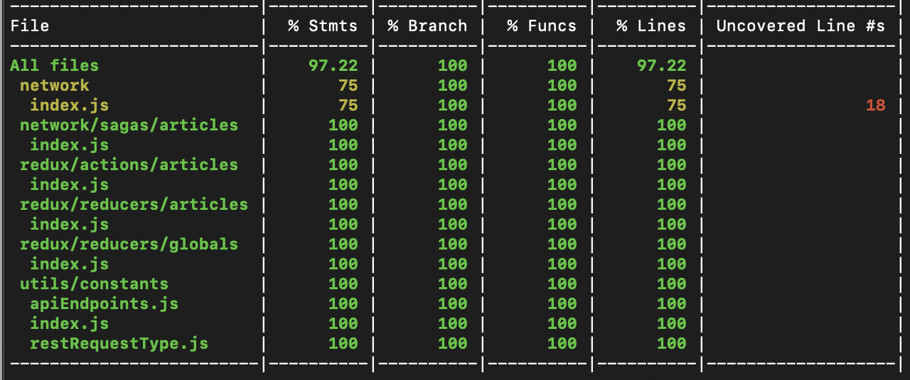

# Project Details

Project is to fetch article data from NYTime using react native framework.

## Application Screenshots

### Home Page


### Detail Page


## Project Structure

App is made using redux architecture.

### Folder structure

```
src
|-components - It contains the particular element of page like ArticleListItem.
|-containers - It contains the Pages/Views of App like ArticlesPage.
|-navigation - It is root file to initialize navigation for whole app.
|-redux- It contains two folder for actions & reducer which connects with redux store.
    |-actions
    |-reducers
|-utils- It contains constants & other utility file
__tests__-It contains test files

```

### Setup the example

Clone the git folder & do these steps in folder

```
npm install
```

And then

```
react-native link
```

## Running the tests

Explain how to run the unit tests for the app

```
npm test
```

### Test Coverage



Open [__coverage__/lcov-report/index.html](__coverage__/lcov-report/index.html) in browser for details.

## Running on Simulator

For iOS:

```
react-native run-ios
```

for Android:

```
react-native run-android
```
